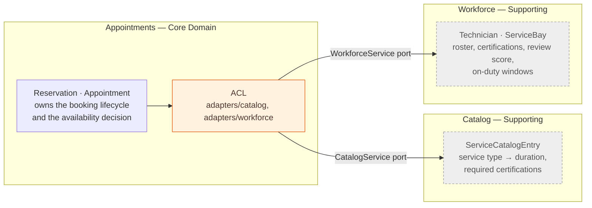
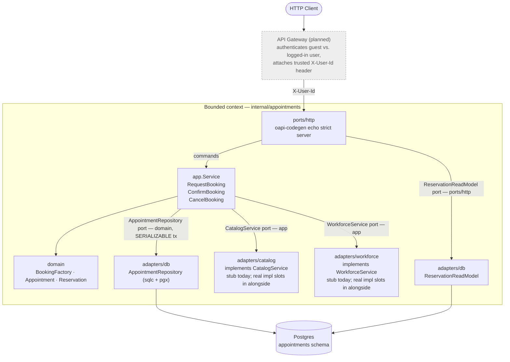
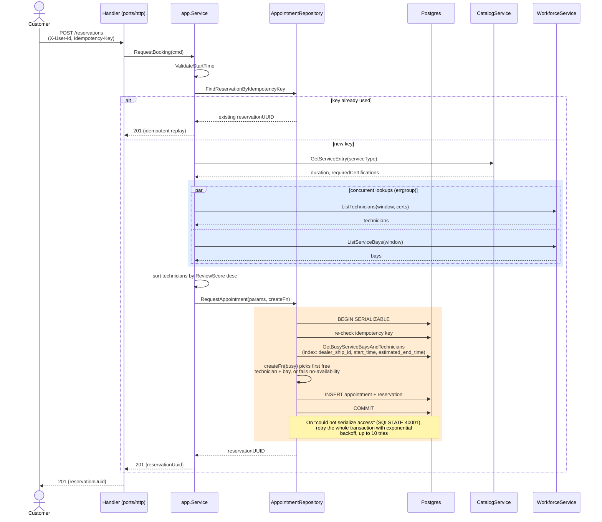
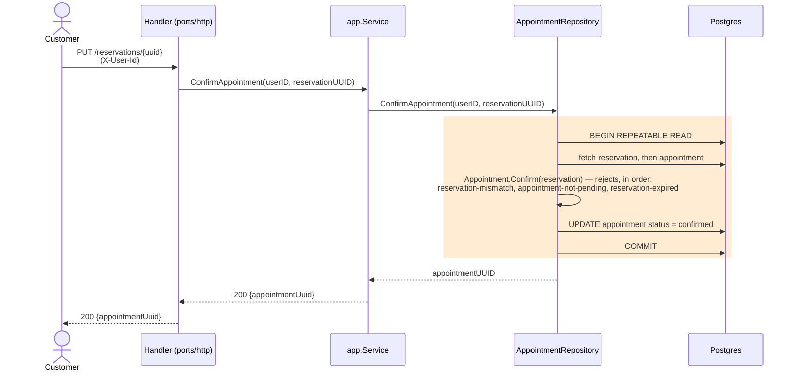
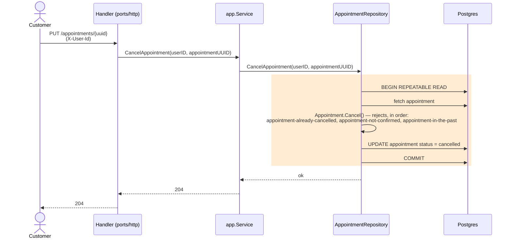

# System Design Document — Unified Service Scheduler

This document covers how the appointment-booking backend is designed, built, and tested, — including the domain model, the architecture, the tech choices, and where GenAI was used.

**Contents**
1. [Problem & Requirements](#1-problem--requirements)
2. [Domain Model & Bounded Context](#2-domain-model--bounded-context)
3. [Technology Choices](#3-technology-choices)
4. [Architecture](#4-architecture)
5. [Data Flow](#5-data-flow)
6. [Component Roles](#6-component-roles)
7. [Testing Strategy](#7-testing-strategy)
8. [Observability Strategy](#8-observability-strategy)
9. [GenAI Usage in the Design Phase](#9-genai-usage-in-the-design-phase)

---

## 1. Problem & Requirements

**Problem Context**: Traditional dealerships manage service appointments using manual whiteboards or paper tickets, leading to double-bookings, poor resource utilization, and lost records.

**Solution**: The Unified Service Scheduler fixes all of this. It automatically checks real-time availability for both technicians and service bays, preventing double-bookings and keeping every record organized.

Four requirements drive every decision in this document:

1. **Request Booking**: The customer initiates an appointment request specifying the vehicle, service type, dealership, and target timeframe.

2. **Confirm Booking**: The system validates real-time resource availability (Technician + Service Bay) and locks in the reservation.

3. **Cancel Booking**: The customer or advisor cancels an existing booking, instantly releasing locked resources while maintaining an audit trail.

4. **View Booking**: The customer or advisor retrieves a reservation's current status and details — including the countdown to hold expiry — at any time.
---

## 2. Domain Model & Bounded Context

*Discovered through Event Storming.*

A booking moves through three states: requesting one creates a **Reservation** — a short hold on a technician and service bay; confirming it before the hold expires turns it into a confirmed **Appointment**; confirmed appointments can be cancelled.

One bounded context, **Appointments**, owns this whole lifecycle. Catalog and Workforce sit outside it — Appointments only asks them for candidates and decides availability itself — so each is consumed through a port (`CatalogService`, `WorkforceService`) rather than pulled into the context.

### Context map

**Appointments is the core domain**. It's the reason this system exists, and it's the only part of the codebase that enforces the real business rules: no double-booking, the two-phase hold, the two expiries.

**Catalog and Workforce are supporting subdomains**. They're real parts of the business, but this project doesn't own them and doesn't try to model them fully.

**Appointments is the customer in both relationships**. It defines its own types — `ServiceCatalogEntry`, `Technician`, `ServiceBay` — and each `adapters/<service>` package translates whatever `Catalog` or `Workforce` actually look like into that shape. Their data models, IDs, and vocabulary never leak into domain.

#### What each one does

Catalog answers one question: given a service type, how long does it take and what certifications does it need? (GetServiceEntry.) Appointments never caches this — it asks fresh every time someone requests a booking.

Workforce answers a different question: for a given time window, which technicians and bays are on duty? (ListTechnicians, ListServiceBays.) "On duty" just means not off that day and not under maintenance. Workforce doesn't know what Appointments has booked — it never says a resource is busy because of our bookings.

#### The Key design decision

Availability is always decided from Appointments' own data, never from what Catalog or Workforce report. They only hand back candidates — technicians and bays that could work. Appointments checks those candidates against its own busy list, inside one database transaction (`GetBusyServiceBaysAndTechnicians`).

**Why this matters**: if Appointments trusted an outside system's idea of "available," two systems could disagree and double-book the same slot. Keeping that decision inside one transaction is what makes the no-double-booking guarantee actually work

---

## 3. Technology Choices

| Choice | Version | Why it matters |
|---|---|---|
| **Golang** | 1.26.1 | Static typing and a single compiled binary keep deployment simple. |
| **Echo Router + OpenAPI (oapi-codegen, strict mode)** | Echo v4.15, oapi-codegen v2.8 | `openapi.yaml` is the single source of truth for both server and client; strict-mode codegen gives handlers fully typed request/response structs, so the contract and the implementation can't drift apart. |
| **sqlc + pgx/v5** | sqlc v1.31, pgx v5.9 | Domain queries are simple — no complex joins — so generated SQL beats ORM overhead on performance. |
| **Postgres** | 17 | Mature ecosystem and native type support that pairs well with pgx/sqlc. |
| **golang-migrate** | v4.19 | Versioned, embedded SQL migrations per bounded context, applied automatically at startup — no manual migration step. |
| **lefthook + Makefile** | lefthook v1.x | The same `make` targets (test, lint, fmt) run locally and as a pre-push hook — bad code is caught before it leaves the machine, not just in CI. |
| **GitHub Actions** | — | Every PR runs the same quality gate (lint → test → build); merging to `main` auto-builds, vulnerability-scans, and publishes the image — nothing is hand-built or hand-shipped. |

---

## 4. Architecture

- **No API Gateway yet** (dashed above): `X-User-Id` is just a caller-supplied header, checked for presence only, not authenticity. Real auth belongs at the gateway.
- `CatalogService`/`WorkforceService` are ports owned by `app`; only stub adapters exist today (`adapters/catalog`, `adapters/workforce`), swappable for real integrations without touching `app`/`domain`. No per-call timeout or circuit breaker exists yet — harmless while stubbed, worth fixing before a real integration lands.
- Ports aren't uniformly `app`-owned: `AppointmentRepository` is declared by `domain`, `ReservationReadModel` by `ports/http` — each lives with whichever layer depends on it.
- Local dev runs via `docker-compose.yaml` with hot reload; production is a statically-built, distroless, non-root image.

---

## 5. Data Flow

The technical counterpart to the Event Storming narrative — what actually happens on the wire for each command. Blue marks work done concurrently; amber marks the database transaction.

### Request Booking

Notes on the write path:

- **Idempotency is checked three times, cheapest first**: a plain read before any external call (skips Catalog/Workforce entirely on retry), a re-check inside the SERIALIZABLE transaction, and a unique-constraint backstop after commit for two identical requests that raced past both checks.
- **The availability read is load-bearing, not a guard.** It runs *inside* the SERIALIZABLE transaction specifically so Postgres's Serializable Snapshot Isolation (SSI) can detect write-skew between concurrent bookings — without that read, two concurrent requests could both see "free" and both commit into the same slot.
- **External calls happen before the transaction**, which can be retried on serialization failure and would otherwise re-issue them.
- **The two workforce lookups run concurrently** (highlighted above, via `errgroup.WithContext`) since neither depends on the other's result — only the prior Catalog call's `duration`/`requiredCertifications` gate them.
- **The retry budget is bounded, not open-ended**: exponential backoff starting at 1ms, doubling up to a 500ms cap, ±50% jitter, 10 tries max (`internal/common/db.go`). Worst case, that adds roughly 1s of latency under sustained contention before the request gives up and returns an error — a concrete tail-latency cost of choosing SERIALIZABLE over a non-retrying strategy.
- **Two expiries, resolved differently**: a `Reservation`'s hold TTL closes the checkout window with no row mutation (checked on read/confirm); an `Appointment`'s no-show state (`pending` with a past start) is computed on read and never stored.

### Confirm & Cancel

Both are simpler than booking: no external calls, no availability contention, just a domain check inside a transaction. They run at **RepeatableRead**, not SERIALIZABLE — there's no concurrent-write-skew risk here, since each only touches one appointment identified by its own UUID.

---

## 6. Component Roles

| Component | Role |
|---|---|
| `cmd/main.go` | Process entrypoint and composition root: builds config, the pgx pool, the external-service stubs, and hands off to `internal.New(...).Run(...)`. |
| `internal/svc.go` | Module lifecycle (`Init` → `RegisterContracts` → `Verify` → `RegisterHttp`) and graceful shutdown via `errgroup`. |
| `internal/common/*` | Shared kernel used by every bounded context: env-driven `config`, Echo bootstrap + middleware (`http`), structured `slog` logging with correlation IDs (`log`), a typed `common.Error` with HTTP-mappable slugs, isolation-level-aware transaction helpers with serialization-failure retry (`db.go`), and an embedded-migration runner. |
| `internal/appointments/domain` | Business rules only — `BookingFactory`, `Appointment`, `Reservation`, validation. No HTTP or DB imports; trusted rows hydrate via `UnmarshalX` without re-validation. |
| `internal/appointments/app` | Use-case orchestration (`Service.RequestBooking`/`ConfirmAppointment`/`CancelAppointment`), and the outbound `CatalogService`/`WorkforceService` port declarations. |
| `internal/appointments/adapters/db` | sqlc-generated, pgx-backed implementation of two ports declared by other layers: `domain.AppointmentRepository` (the SERIALIZABLE write path) and `ports/http`'s `ReservationReadModel` (a CQRS read side), plus the embedded SQL migrations. |
| `internal/appointments/adapters/{catalog,workforce}` | Stub implementations of the outbound ports, injected via `internal.ExternalService`; the seam where real integrations plug in later. |
| `internal/appointments/ports/http` | The HTTP boundary generated from `openapi.yaml` (server, client, and models via oapi-codegen), plus the handlers that translate between HTTP and `app`. |
| Postgres | Durable store, one schema per bounded context (`appointments`), SERIALIZABLE isolation on the booking write path to prevent double-booking under concurrent requests. |
| Docker / docker-compose | Local dev environment (hot-reload, debugger-ready) and a minimal distroless production image. |

---

## 7. Testing Strategy

| Tier | Command | Scope & Ownership | Boundary & Dependencies | Data Strategy |
|---|---|---|---|---|
| Unit | `make test-unit` | **Domain logic & invariants** — table-driven tests covering edge cases, business rules, and state transitions. | Pure Go code. Zero external dependencies (no HTTP, DB, or network). `app/` and `ports/http/` carry none; Component covers them. | N/A — in-memory state instantiated per test. |
| Integration | `make test-integration` | **Adapter & infrastructure correctness** — verifies actual DB driver behavior, SQL syntax, and transactions (e.g. SERIALIZABLE write-skew detection). | Adapters only, against real Postgres (`integration` build tag, `.env.test`) — provable only against the real engine, not an in-memory fake. | Unique entity prefixes — tests construct unique keys/UUIDs per run; never clean or truncate shared state. |
| Component | `make test-component` (`tests/component/`) | **API contract & end-to-end flow** — happy-path service verification driven strictly via the generated OpenAPI client. Covers routing, middleware, and request/response mapping. | Real application stack (HTTP + `app.Service` + DB), but stubs external HTTP services (Catalog, Workforce). | Isolated test fixtures — each test suite generates its own fixture data using unique domain identifiers. |

Each tier owns a distinct kind of correctness, none re-covering the one below it. The test database is long-lived and never truncated, so every tier carves out its own data rather than resetting shared state.

External services are mocked at the Go interface level rather than via HTTP, injected the same way in production and tests, with fixtures deterministic enough that every interesting branch is reachable without a request-matching framework.

---

## 8. Observability Strategy

- **Structured logging** via `log/slog` — JSON in non-dev environments, a human-readable colorized handler in dev.
- **Correlation IDs**: a middleware reads (or generates) a `Correlation-ID` header, attaches a logger carrying it to the request context, and echoes it back on the response — every log line for a request, across every layer, carries the same ID.
- **Request/response logging**: one line per request with method, URI, status, duration, and truncated request/response bodies (full bodies at `debug` level).
- **Typed, stable error responses**: every error surfaces as `{message, slug, details}` — clients can branch on `slug` without parsing prose, and internals never leak past the mapping.

---

## 9. GenAI Usage in the Design Phase

**On this document specifically:** the Event Storming session (Section 2) was human-led domain discovery — the sticky-note board was produced by the person, not generated. GenAI's role there was formalization: transcribing the board into a structured diagram, deriving the bounded-context boundary and the ubiquitous-language table *from* it, and cross-checking every term against the actual domain code (`internal/appointments/CLAUDE.md`, the domain package) rather than inventing or assuming vocabulary. Where the board and the code disagreed on a name (e.g. the board's "Canceled Appointment" vs. the code's `CancelAppointment`), the code was treated as the source of truth and the discrepancy was noted, not silently resolved. The document's structure was likewise revised with GenAI's help to mirror the actual order of the work — stating the problem before the domain model that resulted from investigating it — rather than presenting the finished model as if it existed before the requirements did.

**On the system itself**, GenAI (Claude Code) was used as a hands-on collaborator across the implementation work referenced throughout this document, following a consistent pattern:

1. **Explore before proposing.** Read-only exploration passes over the actual code — often run in parallel — built an accurate, current picture before any change was designed, rather than designing against assumptions about what the code probably did.
2. **Plan, then get explicit approval before editing.** Every non-trivial change (the `RequestBooking` concurrency fan-out, the Makefile fix, the test-parallelization work) was written up as a plan and approved before a single line changed.
3. **Evidence-driven pivots mid-investigation.** The missing database index (Section 5, on `dealer_ship_id, start_time, estimated_end_time`) wasn't assumed fixed once added — it was confirmed via `EXPLAIN`, which showed the query plan actually switching from a sequential scan to an index scan.
4. **Human checkpoints on decisions a human should own.** Widening the SERIALIZABLE retry budget touches production behavior for every concurrent booking, not just tests — that tradeoff (bounded tail-latency increase vs. flaky failures) was laid out with concrete numbers and left to the person to decide, rather than resolved unilaterally.
5. **Empirical verification, not single-run confidence.** Claims of "fixed" were backed by repeated stress runs (`go test -count=N` loops, tens of iterations) comparing failure rates before and after, not a single green run.

The same discipline produced this document: every technical claim in it — file paths, config defaults, dependency versions, middleware behavior — was pulled from the actual code via exploration, not inferred from typical patterns for a service like this one.
