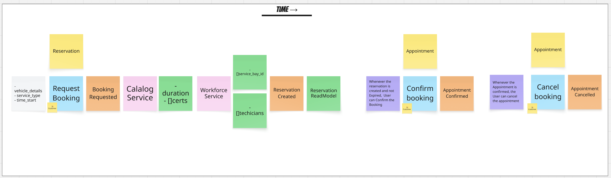
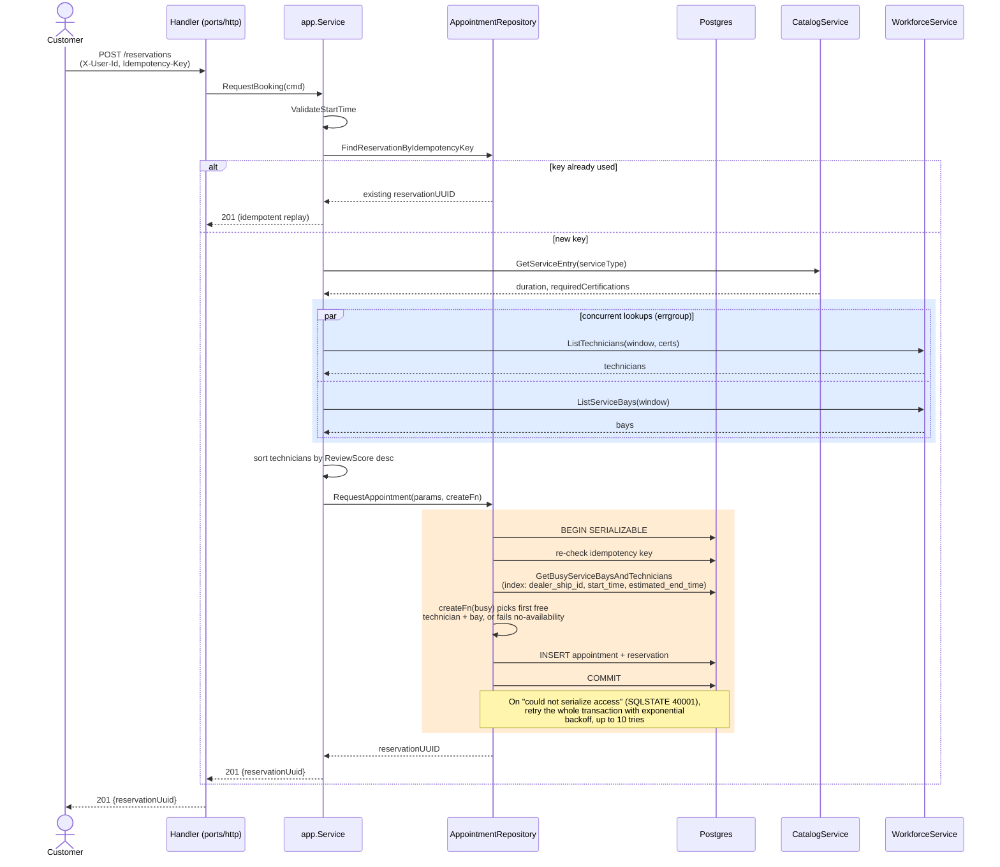
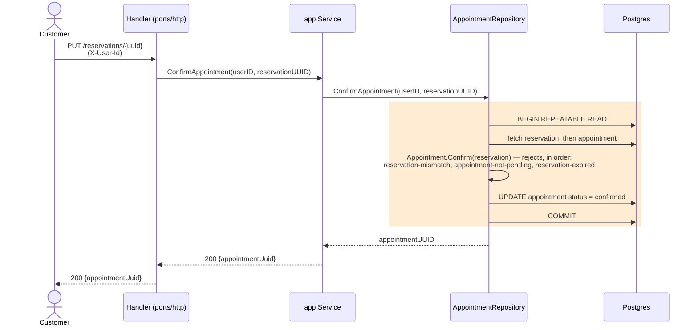
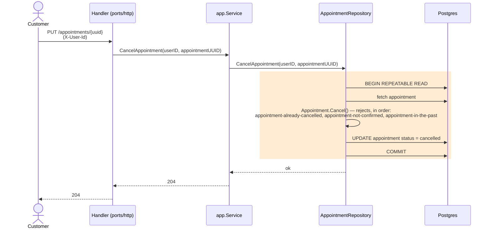

# System Design Document — Unified Service Scheduler

This document describes the appointment-booking backend in this repository: how the domain model was discovered through Event Storming and shaped with Domain-Driven Design, how the code is organized as a Hexagonal (Ports & Adapters) architecture, how data moves through it, why each technology was chosen, how it's tested and released, how it's observed in operation, and how GenAI was used across the design and build process.

**Contents**
1. [Problem & Requirements](#1-problem--requirements)
2. [Domain Model & Bounded Context](#2-domain-model--bounded-context)
3. [Technology Choices](#3-technology-choices)
4. [Data Flow](#4-data-flow)
5. [Architecture](#5-architecture)
6. [Component Roles](#6-component-roles)
7. [Observability Strategy](#7-observability-strategy)
8. [GenAI Usage in the Design Phase](#8-genai-usage-in-the-design-phase)

---

## 1. Problem & Requirements

**Scenario A — The Unified Service Scheduler.** Domain: **Ownership** (post-sale vehicle service).

**Problem Context**: Traditional dealerships manage service appointments using manual whiteboards or paper tickets, leading to double-bookings, poor resource utilization, and lost records.

The Unified Service Scheduler fixes all of this. It automatically checks real-time availability for both technicians and service bays, preventing double-bookings and keeping every record organized.

Four requirements drive every decision in this document:

1. Request Booking: The customer initiates an appointment request specifying the vehicle, service type, dealership, and target timeframe.

2. Confirm Booking: The system validates real-time resource availability (Technician + Service Bay) and locks in the reservation.

3. Cancel Booking: The customer or advisor cancels an existing booking, instantly releasing locked resources while maintaining an audit trail.
---

## 2. Domain Model & Bounded Context

*Discovered through Event Storming — board above.*

A booking moves through three states: requesting one creates a **Reservation** — a short hold on a technician and bay; confirming it before the hold expires turns it into a confirmed **Appointment**; confirmed appointments can be cancelled.

One bounded context, **Appointments**, owns this whole lifecycle. Catalog and Workforce sit outside it — Appointments only asks them for candidates and decides availability itself — so each is consumed through a port (`CatalogService`, `WorkforceService`) rather than pulled into the context.

| Term | Meaning |
|---|---|
| **Reservation** | The hold created the moment a booking is requested; guards an Appointment until confirmed or expired. |
| **Appointment** | The booking record: dealership_id, bay, technician, user, service, vehicle, time window, status. |

This bounded context maps directly onto `internal/appointments/` in the code.

---

## 3. Technology Choices

| Choice | Why it matters |
|---|---|
| **Echo + OpenAPI (oapi-codegen, strict mode)** | `openapi.yaml` is the single source of truth for both server and client; strict-mode codegen gives handlers fully typed request/response structs, so the contract and the implementation can't drift apart. |
| **sqlc + Postgres** | Domain queries are simple — no complex joins — so generated SQL beats ORM overhead on performance |
| **golang-migrate** | Versioned, embedded SQL migrations per bounded context, applied automatically at startup — no manual migration step. |
| **lefthook + Makefile** | The same `make` targets (test, lint, fmt) run locally and as a pre-push hook — bad code is caught before it leaves the machine, not just in CI. |
| **GitHub Actions** | Every PR runs the same quality gate (lint → test → build); merging to `main` auto-builds, vulnerability-scans, and publishes the image — nothing is hand-built or hand-shipped. |

---

## 4. Architecture

- **No API Gateway exists yet** (shown dashed above as planned). Today `X-User-Id` is just a header the caller supplies and `ports/http` handlers check for presence, not authenticity — there's no auth middleware, and nothing distinguishes a guest from a logged-in user. The gateway is where that responsibility belongs: authenticate the caller, resolve guest vs. logged-in, and attach a trustworthy `X-User-Id` before the request ever reaches this bounded context.
- The composition root (`cmd/main.go`, `internal/svc.go`) wires exactly one module today (`appointments`), through `Init` → `RegisterContracts` → `Verify()` → `RegisterHttp`. `Verify()` runs once, after every module has registered, so a missing cross-module contract fails fast at startup rather than at first request. `Svc.Run` uses `errgroup.WithContext` to run the HTTP server and a shutdown watcher as two goroutines — `SIGINT`/`SIGTERM` cancels the context, the watcher closes the pgx pool and calls `echo.Shutdown` with a 30s grace period.
- `CatalogService` and `WorkforceService` are ports — Go interfaces declared and depended on by the `app` layer (`internal/appointments/app/request_appointment.go`). Each is implemented in its own `adapters/<service>` package (`adapters/catalog`, `adapters/workforce`); today only the in-memory stub implementation exists in each, injected via `internal.ExternalService`. The convention is for a real integration to sit beside the stub in the same package once one exists — swappable without touching `app` or `domain`.
- Ports aren't uniformly `app`-owned: `AppointmentRepository` is declared by `domain` (`internal/appointments/domain/appointment.go`) and implemented by `adapters/db`, since it's the domain layer that needs a way to persist and reload its own aggregates. `ReservationReadModel` is declared by `ports/http` itself (`internal/appointments/ports/http/handlers.go`) and also implemented in `adapters/db` — the HTTP layer owns its own read-side dependency because the CQRS query path bypasses `domain`/`app` entirely. Each interface is declared by whichever layer actually depends on it, not by one canonical location.
- Local dev runs both `scheduler-app` and `scheduler-db` (Postgres 17) under `docker-compose.yaml`, with source bind-mounted and a file-watcher (`reflex`) restarting the process on change. Production builds a separate multi-stage image (`docker/app/prod/Dockerfile`): a static, stripped Go binary (`CGO_ENABLED=0`, `-ldflags="-w -s"`) copied onto `gcr.io/distroless/static-debian13:nonroot-amd64` — no shell, no package manager, runs as a non-root user.

---

## 5. Data Flow

The technical counterpart to the Event Storming narrative — what actually happens on the wire for each command. Blue marks work done concurrently; amber marks the database transaction.

### Request Booking

Notes on the write path:

- **Idempotency is checked three times, cheapest first**: a plain read before any external call (skips Catalog/Workforce entirely on retry), a re-check inside the SERIALIZABLE transaction, and a unique-constraint backstop after commit for two identical requests that raced past both checks.
- **The availability read is load-bearing, not a guard.** It runs *inside* the SERIALIZABLE transaction specifically so Postgres's Serializable Snapshot Isolation (SSI) can detect write-skew between concurrent bookings — without that read, two concurrent requests could both see "free" and both commit into the same slot.
- **External calls happen before the transaction**, which can be retried on serialization failure and would otherwise re-issue them.
- **The two workforce lookups run concurrently** (highlighted above, via `errgroup.WithContext`) since neither depends on the other's result — only the prior Catalog call's `duration`/`requiredCertifications` gate them.
- **Two expiries, resolved differently**: a `Reservation`'s hold TTL closes the checkout window with no row mutation (checked on read/confirm); an `Appointment`'s no-show state (`pending` with a past start) is computed on read and never stored.

### Confirm & Cancel

Both are simpler than booking: no external calls, no availability contention, just a domain check inside a transaction. They run at **RepeatableRead**, not SERIALIZABLE — there's no concurrent-write-skew risk here, since each only touches one appointment identified by its own UUID.

The read side (`GetReservation`) skips this shape entirely: it's served directly by the `ReservationReadModel` — a single joined SQL query returning the API response DTO, bypassing the domain and the write-side repository altogether (CQRS).

---

## 6. Component Roles

| Component | Role |
|---|---|
| `cmd/main.go` | Process entrypoint and composition root: builds config, the pgx pool, the external-service stubs, and hands off to `internal.New(...).Run(...)`. |
| `internal/svc.go` | Module lifecycle (`Init` → `RegisterContracts` → `Verify` → `RegisterHttp`) and graceful shutdown via `errgroup`. |
| `internal/common/*` | Shared kernel used by every bounded context: env-driven `config`, Echo bootstrap + middleware (`http`), structured `slog` logging with correlation IDs (`log`), a typed `common.Error` with HTTP-mappable slugs, isolation-level-aware transaction helpers with serialization-failure retry (`db.go`), and an embedded-migration runner. |
| `internal/appointments/domain` | Business rules only — `BookingFactory`, `Appointment`, `Reservation`, validation. No HTTP or DB imports; trusted rows hydrate via `UnmarshalX` without re-validation. |
| `internal/appointments/app` | Use-case orchestration (`Service.RequestBooking`/`ConfirmAppointment`/`CancelAppointment`), and the outbound `CatalogService`/`WorkforceService` port declarations. |
| `internal/appointments/adapters/db` | sqlc-generated, pgx-backed implementation of two ports declared by other layers: `domain.AppointmentRepository` (the SERIALIZABLE write path) and `ports/http`'s `ReservationReadModel` (a CQRS read side), plus the embedded SQL migrations. |
| `internal/appointments/adapters/{catalog,workforce}` | Stub implementations of the outbound ports, injected via `internal.ExternalService`; the seam where real integrations plug in later. |
| `internal/appointments/ports/http` | The HTTP boundary generated from `openapi.yaml` (server, client, and models via oapi-codegen), plus the handlers that translate between HTTP and `app`. |
| Postgres | Durable store, one schema per bounded context (`appointments`), SERIALIZABLE isolation on the booking write path to prevent double-booking under concurrent requests. |
| Docker / docker-compose | Local dev environment (hot-reload, debugger-ready) and a minimal distroless production image. |

---

## 7. Observability Strategy

### Implemented today

- **Structured logging** via `log/slog` — JSON in non-dev environments, a human-readable colorized handler in dev.
- **Correlation IDs**: a middleware reads (or generates) a `Correlation-ID` header, attaches a logger carrying it to the request context, and echoes it back on the response — every log line for a request, across every layer, carries the same ID.
- **Request/response logging**: one line per request with method, URI, status, duration, and truncated request/response bodies (full bodies at `debug` level).
- **Typed, stable error responses**: every error surfaces as `{message, slug, details}` — clients can branch on `slug` without parsing prose, and internals never leak past the mapping.
- **Health/readiness**: `GET /healthz`, plus a Postgres container healthcheck (`pg_isready`) gating app startup in compose.

---

## 8. GenAI Usage in the Design Phase

**On this document specifically:** the Event Storming session (Section 2) was human-led domain discovery — the sticky-note board was produced by the person, not generated. GenAI's role there was formalization: transcribing the board into a structured diagram, deriving the bounded-context boundary and the ubiquitous-language table *from* it, and cross-checking every term against the actual domain code (`internal/appointments/CLAUDE.md`, the domain package) rather than inventing or assuming vocabulary. Where the board and the code disagreed on a name (e.g. the board's "Canceled Appointment" vs. the code's `CancelAppointment`), the code was treated as the source of truth and the discrepancy was noted, not silently resolved. The document's structure was likewise revised with GenAI's help to mirror the actual order of the work — stating the problem before the domain model that resulted from investigating it — rather than presenting the finished model as if it existed before the requirements did.

**On the system itself**, GenAI (Claude Code) was used as a hands-on collaborator across the implementation work referenced throughout this document, following a consistent pattern:

1. **Explore before proposing.** Read-only exploration passes over the actual code — often run in parallel — built an accurate, current picture before any change was designed, rather than designing against assumptions about what the code probably did.
2. **Plan, then get explicit approval before editing.** Every non-trivial change (the `RequestBooking` concurrency fan-out, the Makefile fix, the test-parallelization work) was written up as a plan and approved before a single line changed.
3. **Evidence-driven pivots mid-investigation.** The missing database index (Section 3) wasn't assumed fixed once added — it was confirmed via `EXPLAIN`, which showed the query plan actually switching from a sequential scan to an index scan.
4. **Human checkpoints on decisions a human should own.** Widening the SERIALIZABLE retry budget touches production behavior for every concurrent booking, not just tests — that tradeoff (bounded tail-latency increase vs. flaky failures) was laid out with concrete numbers and left to the person to decide, rather than resolved unilaterally.
5. **Empirical verification, not single-run confidence.** Claims of "fixed" were backed by repeated stress runs (`go test -count=N` loops, tens of iterations) comparing failure rates before and after, not a single green run.

The same discipline produced this document: every technical claim in it — file paths, config defaults, dependency versions, middleware behavior — was pulled from the actual code via exploration, not inferred from typical patterns for a service like this one.
